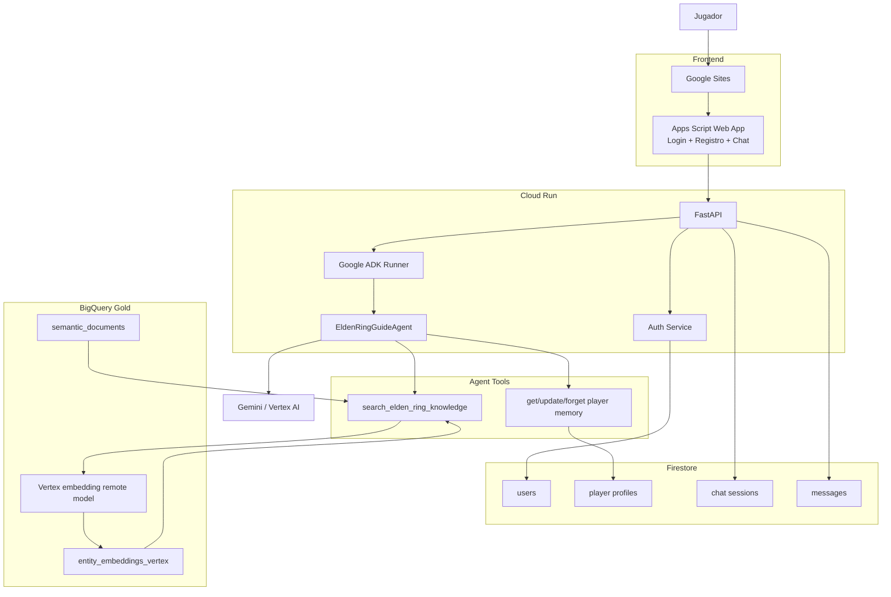

# PRD — Elden Ring Agentic RAG Guide

**Versión:** 1.0  
**Estado:** MVP listo para implementación  
**Fecha objetivo:** 5 de septiembre de 2026  
**Proyecto GCP:** `ah-estefania-alozno`  
**Framework agéntico:** Google Agent Development Kit (ADK)  
**Backend:** FastAPI sobre Cloud Run  
**Frontend:** Google Apps Script embebido en Google Sites  
**Knowledge Base:** BigQuery Gold del proyecto Elden Ring Medallion Lakehouse  
**Memoria / persistencia de aplicación:** Firestore  
**LLM:** Gemini en Vertex AI, configurable por variable de entorno  
**Retrieval:** BigQuery `VECTOR_SEARCH` sobre embeddings Vertex/Gemini  
**Autenticación:** usuario + contraseña propios

---

# 1. Resumen ejecutivo

Se desarrollará una aplicación conversacional agéntica sobre el universo de **Elden Ring** que reutiliza como producto de datos la capa Gold de un proyecto Medallion existente.

El sistema permitirá:

1. Consultar información y lore disponible en la Knowledge Base.
2. Pedir recomendaciones personalizadas de armas, armaduras, ashes, incantations y combinaciones útiles.
3. Obtener un **Top 3** de recomendaciones cuando aplique.
4. Personalizar las recomendaciones a partir de preferencias y stats del jugador.
5. Aprender preferencias de forma progresiva durante la conversación.
6. Persistir memoria por usuario entre sesiones.
7. Permitir al usuario corregir u olvidar memoria mediante lenguaje natural.
8. Persistir el transcript de conversaciones.
9. Autenticar usuarios mediante registro y login simples.
10. Responder en el idioma utilizado por el usuario.
11. Mostrar al final las entidades utilizadas como fuentes.
12. Rechazar o declarar insuficiencia de evidencia cuando la KB no permita responder.

El sistema será diseñado como **MVP académico funcional**, priorizando rapidez de implementación, claridad arquitectónica y facilidad de demostración sobre hardening enterprise.

---

# 2. Contexto y producto de datos existente

El proyecto anterior implementa:

```text
Elden Ring Fan API
        ↓
Bronze
        ↓
Silver
        ↓
Gold
```

La nueva aplicación **NO vuelve a implementar Bronze, Silver ni la creación de documentos semánticos**.

Consume Gold como un Data Product ya terminado.

## 2.1 Corpus disponible

El corpus contiene **1,208 entidades reales**:

| Tipo | Cantidad |
|---|---:|
| armor | 563 |
| weapon | 286 |
| boss | 105 |
| incantation | 100 |
| ash | 94 |
| npc | 60 |
| **Total** | **1,208** |

Tablas fuente existentes:

```text
ah-estefania-alozno.elden_ring_gold.semantic_documents
ah-estefania-alozno.elden_ring_gold.entity_embeddings
```

`semantic_documents` es el contrato principal de texto para el nuevo proyecto.

Contiene, como mínimo:

```text
entity_type
entity_id
name
searchable_text
searchable_text_hash
source_record_hash
source_updated_at
generated_at
template_version
```

## 2.2 Embeddings anteriores

La tabla `entity_embeddings` existente usa:

```text
intfloat/multilingual-e5-small
revision:
614241f622f53c4eeff9890bdc4f31cfecc418b3
dimension: 384
```

Estos embeddings pertenecen al proyecto Medallion anterior y **no deben modificarse ni eliminarse**.

## 2.3 Nueva estrategia de embeddings

Para el sistema agéntico se generará una tabla adicional, esperada como:

```text
ah-estefania-alozno.elden_ring_gold.entity_embeddings_vertex
```

utilizando Vertex/Gemini embeddings sobre el `searchable_text` existente.

La generación de esta tabla se realiza en paralelo por el proyecto Medallion y deberá entregar un archivo:

```text
VERTEX_RAG_HANDOFF.md
```

El backend de este proyecto debe consumir el contrato definido en ese handoff.

Configuración objetivo inicial:

```text
modelo: gemini-embedding-001 o equivalente configurado
dimensión: 768
task documentos: RETRIEVAL_DOCUMENT
task queries: RETRIEVAL_QUERY
```

**Regla:** modelo y dimensión deben ser configurables.

---

# 3. Problema

El corpus Medallion permite recuperación semántica, pero no existe todavía una experiencia conversacional que:

- interprete intención;
- utilice el conocimiento recuperado;
- personalice recomendaciones;
- recuerde preferencias del jugador;
- mantenga aislamiento entre usuarios;
- se despliegue como servicio web;
- provea autenticación;
- genere respuestas grounded.

El nuevo proyecto agrega la capa de aplicación y agente sobre el Data Product existente.

---

# 4. Objetivo del producto

Construir una **Guía Agéntica de Elden Ring** orientada a dos casos principales:

### A. Consulta de conocimiento y lore

Ejemplos:

```text
¿Qué sabes sobre Ranni?
¿Qué lore tiene esta espada?
¿Quién es este NPC?
¿Qué se sabe de este boss según la base?
```

### B. Recomendaciones personalizadas

Ejemplos:

```text
Me gustan las katanas y juego agresivo, ¿qué me recomiendas?
Tengo DEX 40 y ARC 30, ¿qué opciones encajan conmigo?
Quiero algo rápido pero también me interesa el lore.
Dame una combinación de arma y Ash of War.
```

La recomendación deberá utilizar:

```text
pregunta actual
+
preferencias persistidas
+
stats persistidos
+
resultados recuperados desde BigQuery
```

---

# 5. Principios de diseño

## P-01 — Grounding estricto

El agente **no utilizará conocimiento general de Gemini sobre Elden Ring como fuente factual**.

Puede utilizar el LLM para:

- interpretar la intención;
- resumir;
- traducir;
- comparar;
- estructurar;
- razonar sobre documentos recuperados.

No deberá introducir hechos de Elden Ring que no estén respaldados por la KB.

Si no existe evidencia suficiente:

> No tengo suficiente información en mi base de conocimiento para responder eso con confianza.

## P-02 — Data Product reutilizable

El sistema consume Gold.

No reconstruye:

- Bronze;
- Silver;
- templates semánticos;
- corpus original.

## P-03 — Memoria explícita y separada del contexto

Se distinguen:

```text
Contexto de conversación
≠
Memoria persistente del jugador
```

## P-04 — Complejidad mínima

El MVP utilizará **un único agente ADK con tools**.

No se implementará multiagente sin necesidad funcional.

## P-05 — Cost conscious

Se priorizan:

- Cloud Run;
- Firestore;
- BigQuery;
- modelos Gemini económicos/configurables;
- búsqueda vectorial exacta para ~1.2k documentos.

---

# 6. Usuarios

## 6.1 Usuario principal

Jugador de Elden Ring que desea:

- conocer lore;
- explorar entidades;
- recibir recomendaciones;
- obtener recomendaciones adaptadas a sus gustos y build.

## 6.2 Usuario demo / evaluador

Profesor o evaluador del diplomado que debe poder verificar:

- RAG;
- sistema agéntico;
- memoria;
- autenticación;
- persistencia;
- despliegue público.

---

# 7. Alcance MVP

El MVP deberá contener obligatoriamente:

- [x] Registro de usuarios.
- [x] Login.
- [x] Backend FastAPI.
- [x] Google ADK.
- [x] Gemini configurable.
- [x] RAG sobre BigQuery.
- [x] `VECTOR_SEARCH`.
- [x] Corpus Gold existente.
- [x] Memoria persistente en Firestore.
- [x] Stats persistentes.
- [x] Preferencias persistentes.
- [x] Actualización automática de memoria.
- [x] Olvido/corrección de memoria por lenguaje natural.
- [x] Persistencia de conversaciones.
- [x] Nueva sesión conversacional por login.
- [x] Recomendaciones Top 3.
- [x] Lore resumido en recomendaciones.
- [x] Mezcla de categorías cuando sea útil.
- [x] Fuentes al final de las respuestas.
- [x] Multilingüe.
- [x] Frontend Apps Script.
- [x] Embedding en Google Sites.
- [x] Cloud Run.
- [x] Evaluación manual.
- [x] Evaluación LLM-as-a-judge.

---

# 8. Fuera del MVP / TODO

No bloquear la entrega por ninguna de estas funcionalidades.

## TODO-01 — Historial navegable

UI para:

```text
Mis conversaciones
├── Conversación 1
├── Conversación 2
└── Conversación 3
```

Las conversaciones sí se persisten en el MVP, pero no es necesario mostrarlas.

## TODO-02 — Feedback explícito

Agregar:

```text
👍
👎
comentario
```

para evaluar recomendaciones y eventualmente personalizar.

## TODO-03 — Endpoints administrativos

Ejemplos:

```text
GET /sessions
GET /memory
DELETE /memory
```

En el MVP la interacción de memoria ocurre dentro del chat.

## TODO-04 — Observabilidad avanzada

- structured logging;
- métricas custom;
- dashboards;
- trazas;
- métricas de tools;
- costos por usuario.

MVP: logs estándar de Cloud Run.

## TODO-05 — Hardening IAM

Crear service account dedicada con mínimo privilegio.

MVP: usar credenciales/service account del proyecto con permisos suficientes.

## TODO-06 — Restricción de CORS

MVP puede utilizar configuración permisiva para acelerar integración Apps Script / Sites.

Post-MVP: restringir origins.

## TODO-07 — Índice vectorial ANN

Con ~1,208 documentos no es prioritario.

MVP: búsqueda vectorial exacta/brute-force.

Agregar vector index si el corpus crece.

## TODO-08 — Frontend avanzado

- React / Next.js;
- diseño responsive dedicado;
- richer sources;
- cards;
- imágenes.

---

# 9. Arquitectura objetivo



---

# 10. Decisiones arquitectónicas

## ADR-01 — Google ADK

**Decisión:** Google ADK como framework agéntico.

### Justificación

- requisito deseado del proyecto;
- integración natural con Gemini/GCP;
- tool calling;
- Runner y sesiones;
- despliegue compatible con Cloud Run.

---

## ADR-02 — Un agente + tools

**Decisión:** usar un solo agente:

```text
EldenRingGuideAgent
```

Tools mínimas:

```text
search_elden_ring_knowledge
get_player_profile
update_player_memory
forget_player_memory
```

### Razón

La complejidad del caso no justifica coordinación multiagente.

---

## ADR-03 — BigQuery Vector Search en lugar de FAISS

FAISS queda fuera del nuevo serving.

### Razones

- Cloud Run es stateless;
- evitar distribución/carga de índice;
- Gold ya reside en BigQuery;
- corpus pequeño;
- arquitectura más simple.

---

## ADR-04 — Firestore para memoria

BigQuery queda orientado al conocimiento.

Firestore queda orientado al estado operacional del usuario.

---

## ADR-05 — Apps Script + Google Sites

Apps Script será la web app mínima de:

- login;
- registro;
- chat.

Google Sites funcionará como contenedor y URL de presentación.

---

## ADR-06 — Cloud Run

FastAPI + ADK se desplegarán en Cloud Run.

El servicio podrá ser públicamente invocable porque el sistema implementa autenticación propia a nivel aplicación.

---

# 11. Flujo principal

## 11.1 Registro

```text
Usuario
 ↓
POST /register
 ↓
validar username
 ↓
hash password
 ↓
Firestore users
 ↓
respuesta éxito
```

---

## 11.2 Login

```text
username + password
 ↓
POST /login
 ↓
validar password
 ↓
crear token
 ↓
crear nueva chat_session
 ↓
frontend recibe token + session_id
```

Cada login inicia una conversación nueva.

---

## 11.3 Chat

```text
mensaje
 ↓
POST /chat
 ↓
validar token
 ↓
persistir mensaje usuario
 ↓
ADK Runner
 ↓
EldenRingGuideAgent
 ↓
tools necesarias
 ↓
Gemini
 ↓
persistir respuesta
 ↓
respuesta al frontend
```

---

# 12. Autenticación

## 12.1 Requerimiento

Solo:

```text
username
password
```

No implementar:

- email;
- email verification;
- password recovery;
- MFA.

## 12.2 Password storage

Nunca almacenar contraseña en texto plano.

Recomendación MVP:

```text
PBKDF2-HMAC-SHA256
+
salt aleatorio
+
iteraciones configurables
```

Alternativamente bcrypt/Argon2 si la base de código del ejemplo del profesor ya lo implementa.

## 12.3 Token

Después del login el backend devuelve un token firmado.

El frontend lo envía como:

```http
Authorization: Bearer <token>
```

## 12.4 Aislamiento

El backend obtiene `user_id` exclusivamente del token autenticado.

**El LLM nunca podrá elegir un `user_id`.**

Las tools de memoria reciben el usuario desde el contexto seguro de ejecución.

---

# 13. Modelo de Firestore

## 13.1 Usuarios

```text
users/{username_normalized}
```

Ejemplo:

```json
{
  "user_id": "uuid",
  "username": "fany",
  "password_hash": "...",
  "password_salt": "...",
  "created_at": "timestamp"
}
```

---

## 13.2 Perfil persistente

```text
player_profiles/{user_id}
```

Modelo conceptual:

```json
{
  "preferences": {
    "preferred_weapon_types": [
      "katana",
      "twinblade"
    ],
    "playstyle": "aggressive",
    "preferred_effects": [
      "bleed"
    ],
    "preferred_combat_style": "melee"
  },

  "stats": {
    "level": 85,
    "vigor": 40,
    "mind": 15,
    "endurance": 25,
    "strength": 18,
    "dexterity": 45,
    "intelligence": 9,
    "faith": 8,
    "arcane": 35
  },

  "updated_at": "timestamp"
}
```

Todos los campos son opcionales.

No se debe obligar al usuario a completar onboarding.

---

## 13.3 Chat sessions

```text
chat_sessions/{session_id}
```

```json
{
  "session_id": "...",
  "user_id": "...",
  "created_at": "...",
  "status": "active"
}
```

---

## 13.4 Mensajes

Opción recomendada:

```text
chat_sessions/{session_id}/messages/{message_id}
```

```json
{
  "role": "user|assistant",
  "content": "...",
  "created_at": "...",
  "sources": []
}
```

---

# 14. Memoria

## 14.1 Qué se recuerda

Persistir automáticamente:

### Preferencias

- estilo de juego;
- melee/magia/híbrido;
- tipos de arma preferidos;
- efectos preferidos;
- afinidades;
- tendencias estables relevantes a recomendaciones.

### Stats

- level;
- vigor;
- mind;
- endurance;
- strength;
- dexterity;
- intelligence;
- faith;
- arcane.

## 14.2 Qué NO se guarda como memoria estable

No persistir automáticamente como preferencia:

- boss actual;
- zona actual;
- progreso puntual;
- una pregunta aislada;
- estados temporales.

## 14.3 Aprendizaje progresivo

No existe formulario de onboarding obligatorio.

Ejemplo:

```text
Usuario:
me gustan las katanas, juego agresivo y tengo dex 40

Agente:
→ detecta preferencias
→ actualiza Firestore
→ usa esos datos para la recomendación
```

## 14.4 Información faltante

El agente pregunta únicamente cuando el dato faltante impide hacer una recomendación razonable.

Ejemplo:

```text
¿Prefieres combate cuerpo a cuerpo o te interesa también magia?
```

## 14.5 Corrección

```text
Usuario:
ya no juego con arcano, ahora voy full int

Agente:
→ actualiza stats
→ actualiza preferencias si aplica
```

## 14.6 Olvido

```text
Usuario:
olvida que me gustan las katanas
```

El agente invoca:

```text
forget_player_memory
```

## 14.7 Lectura de memoria

Si el usuario pregunta:

```text
¿Qué recuerdas de mí?
```

el agente puede consultar el perfil y explicarlo.

No requiere endpoint dedicado en el MVP.

---

# 15. Sesiones y conversaciones

Se manejarán tres conceptos separados.

## 15.1 Login session

Autenticación del usuario.

## 15.2 ADK conversational session

Se crea una sesión nueva por login.

Objetivo:

- evitar contexto infinito;
- reducir tokens;
- mantener comportamiento predecible.

## 15.3 Transcript persistido

Los mensajes se almacenan en Firestore.

Aunque una nueva sesión empiece en el siguiente login, los transcripts anteriores permanecen almacenados.

### MVP

No mostrar conversaciones anteriores en UI.

### TODO

Agregar selector de historial.

---

# 16. RAG

## 16.1 Tool

Firma conceptual:

```python
search_elden_ring_knowledge(
    query: str,
    top_k: int = 8,
    entity_types: list[str] | None = None
) -> list[RetrievedEntity]
```

## 16.2 RetrievedEntity

```python
class RetrievedEntity(BaseModel):
    rank: int
    score: float | None

    entity_type: str
    entity_id: str
    name: str

    searchable_text: str
```

Puede agregarse metadata adicional si está disponible.

## 16.3 Flujo

```text
query
 ↓
embedding de query
task = RETRIEVAL_QUERY
 ↓
BigQuery VECTOR_SEARCH
 ↓
entity_embeddings_vertex
 ↓
top_k IDs
 ↓
semantic_documents / texto
 ↓
ADK tool result
```

## 16.4 Búsqueda exacta

Con ~1,208 documentos:

```text
VECTOR_SEARCH sin vector index
```

es suficiente para MVP.

No optimizar antes de ser necesario.

---

# 17. Recomendador

## 17.1 Detección implícita

No existirá un botón especial.

El agente detecta intención:

```text
recommendation_intent = true
```

cuando el usuario pide:

- qué arma usar;
- qué equipo le conviene;
- opciones para cierta preferencia;
- alternativas;
- combinaciones.

## 17.2 Flujo

```text
petición
 ↓
get_player_profile
 ↓
identificar preferencias relevantes
 ↓
si falta información crítica → preguntar
 ↓
crear query de retrieval enriquecida
 ↓
search_elden_ring_knowledge
 ↓
rankear/razonar usando exclusivamente evidencia
 ↓
Top 3
```

## 17.3 Categorías

El recomendador puede mezclar:

```text
weapon
armor
ash
incantation
```

cuando tenga sentido.

No debe forzar una entidad de cada categoría.

## 17.4 Formato esperado

```markdown
### 1. <opción>

**Por qué te encaja:** ...
**Qué aporta:** ...
**Lore:** ...

### 2. <opción>

...

### 3. <opción>

...

**Fuentes**
- weapon · ...
- ash · ...
- incantation · ...
```

## 17.5 Lore

Cada recomendación incluirá un resumen breve de lore **solo si la evidencia recuperada lo soporta**.

---

# 18. Respuestas de lore / conocimiento

Para preguntas no orientadas a recomendación:

```text
pregunta
 ↓
RAG
 ↓
síntesis
 ↓
respuesta
 ↓
fuentes
```

No utilizar memoria si no mejora la respuesta.

---

# 19. Multilingüe

La KB puede estar en inglés.

El agente debe:

1. detectar el idioma del mensaje;
2. recuperar semánticamente;
3. sintetizar;
4. responder en el idioma del usuario.

El idioma **no se persiste** en Firestore.

Puede cambiar entre conversaciones o incluso dentro de una conversación.

---

# 20. Fuentes

Todas las respuestas factuales o recomendaciones basadas en RAG incluirán fuentes al final.

Formato mínimo:

```markdown
**Fuentes**
- weapon · Moonveil
- npc · Ranni the Witch
- ash · Bloody Slash
```

No se requiere mostrar:

- score;
- confidence;
- embeddings;
- métricas internas.

---

# 21. Comportamiento ante evidencia insuficiente

Casos:

```text
retrieval vacío
resultados irrelevantes
pregunta fuera del corpus
mecánica no documentada
```

Respuesta:

```text
No tengo suficiente información en mi base de conocimiento para responder esa pregunta.
```

El agente puede sugerir reformular la consulta, pero no inventar.

---

# 22. Agent tools

## 22.1 `get_player_profile`

Entrada:

```text
ninguna entrada de user_id generada por el modelo
```

Salida:

```json
{
  "preferences": {},
  "stats": {}
}
```

---

## 22.2 `update_player_memory`

Entrada conceptual:

```json
{
  "preferences_patch": {},
  "stats_patch": {}
}
```

Debe hacer merge parcial.

---

## 22.3 `forget_player_memory`

Entrada:

```json
{
  "fields": [
    "preferences.preferred_weapon_types"
  ]
}
```

Debe borrar solo los campos solicitados.

---

## 22.4 `search_elden_ring_knowledge`

Entrada:

```json
{
  "query": "...",
  "top_k": 8,
  "entity_types": null
}
```

---

# 23. Instrucción del agente

El system instruction deberá incluir al menos:

```text
Eres una guía especializada en el corpus proporcionado de Elden Ring.

Tus hechos sobre Elden Ring deben estar respaldados por resultados
recuperados mediante search_elden_ring_knowledge.

No completes información faltante usando tu conocimiento preentrenado.

Cuando el usuario pida recomendaciones:
1. consulta su perfil cuando sea relevante;
2. pregunta solo si falta información necesaria;
3. recupera evidencia;
4. devuelve hasta 3 opciones;
5. explica brevemente por qué encajan;
6. incluye lore cuando la evidencia lo soporte;
7. lista las fuentes al final.

Detecta preferencias y stats estables expresados por el usuario y
persistelos mediante update_player_memory.

Si el usuario corrige información, actualízala.

Si pide olvidar algo, usa forget_player_memory.

Si pregunta qué recuerdas de él, usa get_player_profile.

Responde en el idioma utilizado por el usuario.
```

---

# 24. Backend API

Endpoints MVP únicamente.

## `GET /health`

Respuesta:

```json
{
  "status": "ok"
}
```

---

## `POST /register`

Request:

```json
{
  "username": "fany",
  "password": "..."
}
```

Response:

```json
{
  "created": true
}
```

---

## `POST /login`

Request:

```json
{
  "username": "fany",
  "password": "..."
}
```

Response:

```json
{
  "access_token": "...",
  "session_id": "..."
}
```

---

## `POST /chat`

Headers:

```http
Authorization: Bearer <token>
```

Request:

```json
{
  "session_id": "...",
  "message": "..."
}
```

Response MVP puede ser:

```json
{
  "message": "...",
  "sources": [
    {
      "entity_type": "weapon",
      "entity_id": "...",
      "name": "..."
    }
  ]
}
```

Si el ejemplo del profesor ya implementa streaming NDJSON correctamente, se permite reutilizar ese patrón.

---

# 25. Frontend

Apps Script Web App.

## 25.1 Pantallas

Solo:

```text
Login
Registro
Chat
```

## 25.2 Login

```text
username
password
botón entrar
link registrarse
```

## 25.3 Chat

```text
mensajes
textarea
botón enviar
logout
```

## 25.4 Estado frontend

Guardar durante la sesión:

```text
token
session_id
```

Al logout:

```text
borrar token
borrar session_id
volver a login
```

El siguiente login genera una sesión nueva.

---

# 26. Google Sites

La aplicación Apps Script deberá publicarse como Web App y posteriormente incrustarse en Google Sites.

Objetivo del entregable:

```text
URL Google Sites
        ↓
Apps Script embebido
        ↓
servicio Cloud Run activo
```

---

# 27. CORS

Cloud Run deberá permitir solicitudes desde la UI.

Para MVP se permite configuración amplia si simplifica Apps Script/Sites.

El token sigue siendo obligatorio para `/chat`.

TODO post-MVP:

```text
restringir origins
```

---

# 28. Modelo LLM

No hardcodear el modelo.

Variables:

```env
GEMINI_MODEL=<modelo_configurado>
VERTEX_LOCATION=<region>
```

El proyecto prioriza un modelo Gemini económico.

La selección puede cambiar sin modificar código.

---

# 29. Variables de entorno

Ejemplo:

```dotenv
GCP_PROJECT_ID=ah-estefania-alozno

BQ_LOCATION=US
BQ_GOLD_DATASET=elden_ring_gold
BQ_SEMANTIC_DOCUMENTS_TABLE=semantic_documents
BQ_VERTEX_EMBEDDINGS_TABLE=entity_embeddings_vertex
BQ_VERTEX_REMOTE_MODEL=<remote_model_name>

VERTEX_EMBEDDING_MODEL=<configured_embedding_model>
VERTEX_EMBEDDING_DIMENSION=768

GEMINI_MODEL=<configured_chat_model>
VERTEX_LOCATION=<configured_location>

JWT_SECRET=<secret>
JWT_TTL_MINUTES=480

FIRESTORE_DATABASE=(default)

RAG_TOP_K=8
RECOMMENDATION_COUNT=3
```

No commitear:

```text
JWT_SECRET
credenciales
tokens
```

---

# 30. Service Account / IAM

## MVP

Usar la identidad/service account disponible del proyecto con permisos suficientes para avanzar rápidamente.

Debe poder:

```text
leer BigQuery
ejecutar jobs BigQuery
usar el remote embedding model
usar Vertex AI
leer/escribir Firestore
ejecutar Cloud Run
```

## Post-MVP

Crear service account dedicada:

```text
elden-ring-agent-sa
```

con mínimo privilegio.

---

# 31. Estructura recomendada

```text
elden-ring-agent/
├── README.md
├── PRD.md
├── .env.example
├── .gitignore
├── requirements.txt
├── Dockerfile
│
├── backend/
│   ├── __init__.py
│   ├── main.py
│   ├── config.py
│   │
│   ├── auth/
│   │   ├── models.py
│   │   ├── service.py
│   │   └── dependencies.py
│   │
│   ├── agent/
│   │   ├── agent.py
│   │   ├── runner.py
│   │   └── instructions.py
│   │
│   ├── tools/
│   │   ├── rag.py
│   │   └── memory.py
│   │
│   ├── repositories/
│   │   ├── bigquery_repository.py
│   │   └── firestore_repository.py
│   │
│   └── models/
│       ├── api.py
│       ├── memory.py
│       └── rag.py
│
├── frontend/
│   └── apps-script/
│       ├── Code.gs
│       ├── Index.html
│       ├── styles.html
│       └── script.html
│
├── evaluation/
│   ├── cases.yaml
│   ├── manual_evaluation.md
│   └── llm_judge.py
│
└── tests/
    ├── test_auth.py
    ├── test_memory.py
    └── test_rag.py
```

Si el código del profesor contiene una estructura funcional equivalente, **reutilizar su patrón en lugar de refactorizar por estética**.

---

# 32. Dependencias principales

Conceptuales:

```text
google-adk
fastapi
uvicorn
google-cloud-bigquery
google-cloud-firestore
google-cloud-aiplatform / SDK requerido por ADK
pydantic
pydantic-settings
JWT library o implementación existente
```

No agregar:

```text
faiss
torch
sentence-transformers
```

al backend agéntico.

---

# 33. Cloud Run

El contenedor contendrá:

```text
FastAPI
Google ADK
BigQuery client
Firestore client
Vertex/Gemini client
```

No contendrá modelos locales de embeddings.

Configuración MVP sugerida:

```text
CPU estándar
memoria moderada
allow unauthenticated a nivel Cloud Run
autenticación manejada por aplicación
```

La app debe escuchar:

```text
0.0.0.0:$PORT
```

---

# 34. Evaluación

Se implementarán dos niveles.

---

## 34.1 Evaluación manual

Crear entre **10 y 20 prompts**.

Categorías mínimas:

### Lore

```text
¿Qué sabes sobre <entidad existente>?
Explícame brevemente el lore de <arma>.
```

### Retrieval multilingüe

```text
consulta español
consulta inglés
```

### Recommendation

```text
Prefiero katanas y DEX, recomiéndame algo.
```

### Recommendation + memory

Conversación:

```text
Turno 1:
me gusta jugar agresivo

Turno 2:
prefiero katanas

Turno 3:
¿qué me recomiendas?
```

Verificar que la respuesta use las preferencias.

### Persistent memory

```text
Login 1:
prefiero katanas

logout

Login 2:
¿qué estilo de armas me gusta?
```

Esperado:

```text
recupera memoria desde Firestore
```

### Memory correction

```text
ya no prefiero katanas, ahora quiero magia
```

### Memory forget

```text
olvida que prefiero magia
```

### Out-of-KB

Pregunta sobre información no cubierta.

Esperado:

```text
no inventa
```

---

## 34.2 Métricas manuales

Escala sugerida 1–5:

| Métrica | Descripción |
|---|---|
| Retrieval relevance | resultados recuperados relevantes |
| Groundedness | afirmaciones respaldadas por fuentes |
| Answer relevance | responde lo pedido |
| Personalization | usa correctamente perfil/stats |
| Recommendation usefulness | opciones coherentes |
| Lore fidelity | resumen coincide con documentos |
| Language consistency | mantiene idioma |
| Source correctness | fuentes realmente utilizadas |

---

# 35. Evaluación automática — LLM as a Judge

Utilizar Gemini como juez sobre un dataset de evaluación.

Entrada al juez:

```text
user_question
player_profile
retrieved_documents
assistant_answer
```

Salida estructurada:

```json
{
  "groundedness": 1,
  "relevance": 1,
  "personalization": 1,
  "source_alignment": 1,
  "hallucination_detected": false,
  "reason": "..."
}
```

Escala recomendada:

```text
1 a 5
```

## 35.1 Regla importante

El juez no reemplaza la evaluación manual.

Ambas deben documentarse.

---

# 36. Criterios mínimos de evaluación

MVP objetivo:

```text
Groundedness promedio >= 4/5
Relevance promedio >= 4/5
Personalization >= 4/5 en casos aplicables
0 fugas de memoria entre usuarios
0 passwords almacenados en texto plano
100% respuestas RAG con fuentes cuando corresponda
```

No tratar estas métricas como benchmark científico; son evidencia académica del funcionamiento.

---

# 37. Seguridad

## MVP

Implementar:

- password hashing;
- Bearer token;
- aislamiento por `user_id`;
- validación de inputs;
- secretos por variables de entorno;
- no exponer credenciales;
- tool de memoria ligada al usuario autenticado;
- consultas BigQuery read-only desde la tool RAG.

## Deuda técnica aceptada

- service account no dedicada;
- CORS permisivo;
- auth simplificada;
- sin recuperación de password;
- sin rate limiting.

Documentarlo explícitamente.

---

# 38. Riesgos

| Riesgo | Mitigación MVP |
|---|---|
| Vertex embeddings todavía no terminados | consumir contrato del `VERTEX_RAG_HANDOFF.md` cuando esté listo |
| Query embedding incompatible | usar mismo remote model, dimensión y task definidos en handoff |
| Hallucination | grounding estricto + fuentes |
| Firestore mal configurado | health/test de lectura/escritura |
| Cloud Run sin permisos | usar identidad del proyecto con permisos amplios para MVP |
| Apps Script bloqueado por CORS | permitir origin amplio temporalmente |
| Contexto crece demasiado | nueva sesión por login |
| ADK session in-memory se pierde | memoria importante y transcript viven en Firestore |
| Usuario no proporciona stats | preguntar solo cuando sean necesarios |
| Corpus no cubre mecánicas | responder insuficiencia |
| Demora de BigQuery | corpus pequeño + top_k reducido |
| Costos | corpus pequeño + modelo configurable |

---

# 39. Dependencias externas de implementación

Antes de completar RAG debe existir:

```text
VERTEX_RAG_HANDOFF.md
```

Ese archivo debe definir exactamente:

```text
tabla de embeddings Vertex
modelo
dimensión
remote model
task type
query SQL / función recomendada
VECTOR_SEARCH probado
permisos
```

El backend deberá adaptarse a ese contrato y **no asumir nombres diferentes si el handoff final cambia**.

---

# 40. Plan de implementación MVP

Orden recomendado para minimizar bloqueos.

## Fase 1 — Skeleton

1. Crear repo/proyecto.
2. Copiar patrón FastAPI + ADK del ejemplo del profesor.
3. Implementar `/health`.
4. Dockerizar.
5. Ejecutar local.

**Done:** FastAPI responde.

---

## Fase 2 — Auth + Firestore

1. Crear Firestore.
2. `users`.
3. `/register`.
4. `/login`.
5. token.
6. auth dependency.

**Done:** dos usuarios pueden registrarse y autenticarse de forma independiente.

---

## Fase 3 — Memoria

1. `player_profiles`.
2. `get_player_profile`.
3. `update_player_memory`.
4. `forget_player_memory`.
5. probar aislado.

**Done:** preferencias sobreviven nuevo login.

---

## Fase 4 — RAG

1. Recibir `VERTEX_RAG_HANDOFF.md`.
2. implementar query embedding.
3. implementar `VECTOR_SEARCH`.
4. retornar `top_k`.
5. probar sin LLM.

**Done:** preguntas semánticas recuperan entidades relevantes.

---

## Fase 5 — ADK

1. Crear `EldenRingGuideAgent`.
2. registrar tools.
3. implementar grounding.
4. Top 3 recomendador.
5. fuentes.
6. multilingual.

**Done:** `/chat` produce respuesta grounded.

---

## Fase 6 — Transcript

Persistir:

```text
user message
assistant message
sources
```

en Firestore.

**Done:** transcript existe aunque se haga logout.

---

## Fase 7 — Frontend

1. Login.
2. Registro.
3. Chat.
4. logout.
5. token/session state.

**Done:** aplicación utilizable desde Apps Script.

---

## Fase 8 — Cloud Run

1. Build.
2. Deploy.
3. variables.
4. permisos.
5. test `/health`.
6. test auth.
7. test chat.

**Done:** URL pública funcional.

---

## Fase 9 — Sites

1. Crear Google Site.
2. Incrustar Apps Script.
3. validar login.
4. validar chat.

**Done:** URL final entregable.

---

## Fase 10 — Evaluación

1. casos manuales.
2. LLM judge.
3. recopilar resultados.
4. screenshots/evidencia.

**Done:** métricas documentadas.

---

# 41. Prioridad en caso de tiempo crítico

Si se agota el tiempo:

## P0 — imprescindible

```text
Cloud Run
/register
/login
/chat
ADK
RAG
Firestore memory
respuesta con fuentes
Google Sites/App Script funcionando
```

## P1 — importante

```text
Top 3 recomendador
stats
olvido/corrección
transcript persistido
evaluación manual
```

## P2 — completar si alcanza

```text
LLM judge
UI pulida
más tests
```

## P3 — fuera del MVP

Todo lo definido como TODO.

---

# 42. Pruebas mínimas

## Auth

```text
register válido
username duplicado
password incorrecto
token inválido
/chat sin token
```

## Memory

```text
guardar preferencia
guardar stats
actualizar preferencia
olvidar preferencia
aislamiento usuario A/B
```

## RAG

```text
query vacía
query normal
top_k
entity_type filter
resultados con nombre/id/texto
```

## Agent

```text
lore grounded
recommendation top 3
sources
idioma
insuficiencia
memoria automática
```

---

# 43. Casos de aceptación end-to-end

## Caso A — Registro

```text
Given usuario nuevo
When se registra
Then puede iniciar sesión
```

## Caso B — RAG

```text
Given usuario autenticado
When pregunta por una entidad cubierta
Then la respuesta usa BigQuery retrieval
And muestra fuentes
```

## Caso C — Personalización

```text
Given el usuario dice que prefiere katanas y DEX
When pide una recomendación
Then recibe máximo 3 opciones
And la explicación utiliza esas preferencias
```

## Caso D — Memoria

```text
Given el usuario dijo que prefiere katanas
And cerró sesión
When inicia sesión nuevamente
Then esa preferencia sigue disponible
```

## Caso E — Corrección

```text
Given el usuario tenía DEX 40
When dice "ahora tengo DEX 55"
Then Firestore queda actualizado a 55
```

## Caso F — Olvido

```text
When dice "olvida que prefiero katanas"
Then esa preferencia deja de existir
```

## Caso G — Aislamiento

```text
Given usuario A y usuario B
Then A nunca recibe memoria de B
```

## Caso H — Grounding

```text
Given pregunta fuera del corpus
Then el agente declara información insuficiente
And no inventa la respuesta
```

## Caso I — Multilingüe

```text
Given pregunta en inglés
Then respuesta en inglés

Given pregunta en español
Then respuesta en español
```

---

# 44. Definition of Done — MVP

El proyecto se considera listo para entrega cuando:

- [ ] existe una URL de Google Sites accesible;
- [ ] Apps Script está embebido;
- [ ] el usuario puede registrarse;
- [ ] el usuario puede hacer login;
- [ ] el usuario puede enviar mensajes;
- [ ] FastAPI corre en Cloud Run;
- [ ] Google ADK controla la conversación;
- [ ] el sistema consulta BigQuery mediante Vector Search;
- [ ] se utiliza el corpus Gold existente;
- [ ] el sistema genera respuestas grounded;
- [ ] se muestran fuentes;
- [ ] las recomendaciones pueden devolver Top 3;
- [ ] el recomendador utiliza memoria cuando corresponde;
- [ ] preferencias se guardan automáticamente;
- [ ] stats se guardan automáticamente;
- [ ] el usuario puede corregir memoria;
- [ ] el usuario puede pedir olvidar memoria;
- [ ] el usuario puede preguntar qué se recuerda;
- [ ] la memoria sobrevive un nuevo login;
- [ ] cada login inicia una nueva conversación;
- [ ] transcripts quedan persistidos;
- [ ] usuarios distintos no comparten memoria;
- [ ] el agente responde en el idioma del usuario;
- [ ] el agente rechaza preguntas sin evidencia suficiente;
- [ ] existe evaluación manual;
- [ ] existe evaluación automática LLM-as-a-judge;
- [ ] existe documentación PDF de razonamiento y arquitectura.

---

# 45. Contenido recomendado del PDF de entrega

El PDF final deberá construirse a partir de este PRD y de la evidencia del sistema.

## 1. Problema y objetivo

Qué se construyó y por qué.

## 2. Reutilización del proyecto Medallion

```text
Bronze → Silver → Gold → Agentic RAG
```

## 3. Arquitectura

Diagrama completo.

## 4. RAG

- corpus;
- embeddings;
- query embedding;
- Vector Search;
- grounding;
- fuentes.

## 5. Sistema agéntico

- ADK;
- agente;
- tools;
- por qué un agente y no multiagente.

## 6. Memoria

Diferencia entre:

```text
session context
persistent player memory
conversation transcript
```

## 7. Autenticación

- username/password;
- hashing;
- token;
- aislamiento.

## 8. Despliegue

- Cloud Run;
- Apps Script;
- Google Sites;
- Firestore;
- BigQuery.

## 9. Evaluación

- casos manuales;
- métricas;
- LLM-as-a-judge.

## 10. Decisiones y trade-offs

- Vector Search vs FAISS;
- Firestore vs BigQuery para memoria;
- single agent vs multiagent;
- IAM amplio por velocidad;
- Apps Script vs frontend dedicado.

## 11. Limitaciones

- corpus comunitario;
- grounding restringido a la KB;
- auth simplificada;
- deuda técnica.

## 12. Mejoras futuras

Todos los TODO post-MVP.

## 13. URL

URL del servicio activo.

---

# 46. Resultado esperado

La experiencia final será aproximadamente:

```text
Usuario:
me gustan las katanas y juego agresivo.
tengo dex 40 y arc 30.
¿qué me recomiendas?

        ↓

EldenRingGuideAgent
        ↓
get_player_profile()
        ↓
update_player_memory()
        ↓
search_elden_ring_knowledge()
        ↓
BigQuery VECTOR_SEARCH
        ↓
Gemini grounded generation

        ↓

Top 3 recomendaciones
+ por qué encajan
+ información disponible
+ lore resumido
+ fuentes
```

En una sesión futura:

```text
Usuario:
¿qué me recomendarías ahora?

        ↓

Firestore
→ recuerda DEX/ARC
→ recuerda katanas
→ recuerda estilo agresivo

        ↓

recomendación personalizada
```

Ese comportamiento demuestra de forma explícita los tres requisitos principales del diplomado:

```text
RAG
+
Memoria
+
Autenticación
```

sobre una aplicación agéntica desplegada y accesible mediante URL.
